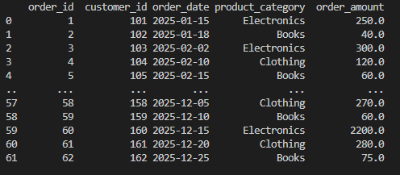
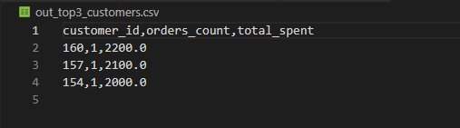
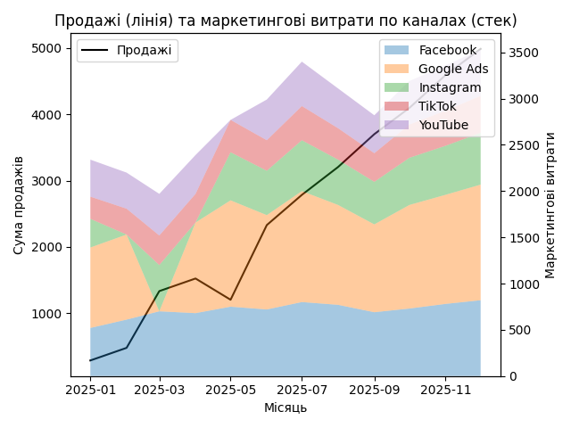

# Висновки

- Продажі демонструють стабільне зростання протягом року, що свідчить про позитивний вплив маркетингових кампаній.
- Збільшення маркетингових витрат корелює зі зростанням продажів, отже інвестиції в маркетинг є виправданими.
- **Google Ads** є ключовим каналом зі стабільною ефективністю.
- **Facebook та Instagram** показують хороше співвідношення витрат і результату та мають високий ROI.
- **TikTok** має потенціал зростання ефективності та доцільний для подальшого тестування.
- **YouTube** виконує переважно брендову функцію з менш прямим впливом на продажі.
- 

Кількість замовлень та сума продажів по категоріях за кожен місяць

- Топ-3 клієнти формують значну частку загального доходу, що підкреслює важливість роботи з high-value клієнтами.

Найвищий ROI спостерігається у місяцях із контрольованими маркетинговими витратами.

